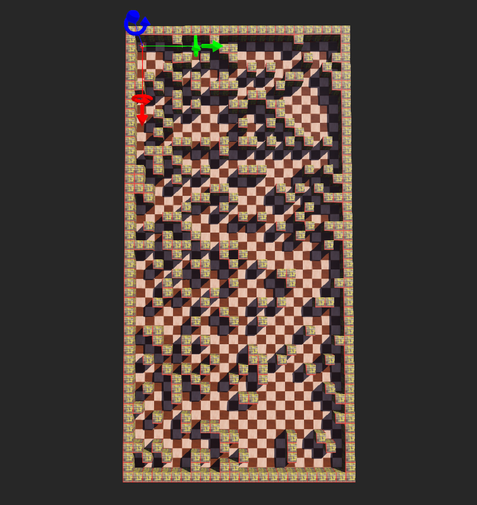
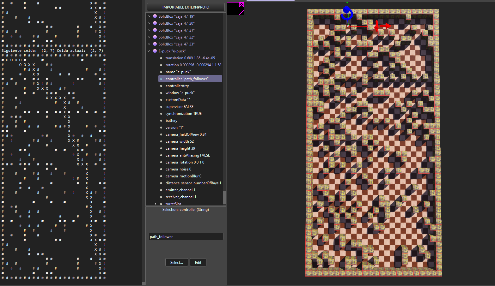
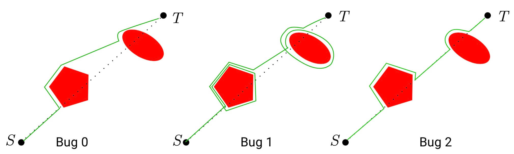

# Proyecto de Planificación de Rutas en Webots

Este proyecto incluye herramientas para generar mapas tipo laberinto y convertirlos a un formato compatible con el entorno de simulación Webots. Y contine distintos algoritmos para la planificación de rutas en WEBOTS

**Autor: Fernando Vela Hidalgo** (GitHub: [github.com/fervh](https://github.com/fervh))
Este proyecto es parte de la asignatura "Simuladores de Robots" en la Universidad Carlos III de Madrid (UC3M).

## Generador de Mapas

El generador de mapas funciona mediante la creación de un laberinto a partir del nombre y apellido proporcionados, junto con una densidad de obstáculos especificada.  Al inicio del script se definen varias variables descritas a continuación.

### Variables
- `altura_caja_píxel`: Altura de la caja en píxeles.
- `resolution`: Resolución del mapa en píxeles por metro.
- `metro_por_píxel`: Factor de conversión de metros a píxeles.


### Uso
Para generar un laberinto, ejecuta el script `maze_generator.py` con los siguientes parámetros:

- `--map`: Nombre del archivo CSV para guardar el laberinto.
- `--name`: Tu nombre para determinar las dimensiones del laberinto.
- `--surname`: Tu apellido para determinar las dimensiones del laberinto.
- `--obstacle-density`: Densidad de obstáculos en el laberinto (valor entre 0 y 1).
- `--multiplication`: Factor de multiplicación para las dimensiones del laberinto.

Ejemplo:
```bash
python generate_wbt_obstacle_density.py --map map1.csv --name Fernando --surname Vela --obstacle-density 0.3 --multiplication 5
```

Salida : 
```bash
Laberinto generado con dimensiones: 40x20
[[1. 1. 1. 1. 1. 1. 1. 1. 1. 1. 1. 1. 1. 1. 1. 1. 1. 1. 1. 1.]
 [1. 0. 1. 1. 0. 1. 1. 1. 0. 0. 0. 1. 0. 0. 0. 1. 0. 0. 1. 1.]
 [1. 1. 0. 0. 1. 1. 0. 1. 0. 0. 1. 0. 0. 0. 1. 1. 0. 1. 0. 1.]
 [1. 0. 1. 0. 0. 1. 0. 1. 0. 0. 1. 1. 0. 1. 1. 0. 0. 0. 0. 1.]
 [1. 0. 1. 0. 1. 0. 1. 0. 0. 1. 0. 1. 0. 0. 0. 0. 0. 0. 0. 1.]
 [1. 0. 0. 0. 0. 0. 0. 0. 0. 0. 0. 0. 0. 1. 0. 1. 0. 0. 0. 1.]
 [1. 1. 0. 0. 0. 1. 0. 0. 0. 0. 0. 0. 1. 0. 0. 1. 0. 0. 1. 1.]
 [1. 0. 0. 0. 1. 1. 1. 1. 0. 0. 0. 0. 0. 1. 0. 0. 0. 0. 0. 1.]
 [1. 1. 1. 1. 0. 0. 0. 1. 0. 0. 0. 0. 1. 0. 0. 0. 0. 1. 0. 1.]
 [1. 0. 0. 0. 0. 0. 1. 0. 0. 0. 0. 1. 1. 1. 0. 0. 0. 0. 0. 1.]
 [1. 0. 0. 1. 0. 0. 1. 0. 0. 0. 1. 1. 0. 0. 1. 0. 0. 0. 0. 1.]
 [1. 0. 0. 0. 0. 0. 1. 0. 0. 1. 0. 0. 0. 0. 0. 1. 0. 0. 0. 1.]
 [1. 0. 0. 0. 1. 0. 0. 0. 0. 0. 0. 0. 0. 0. 0. 0. 1. 1. 1. 1.]
 [1. 0. 0. 0. 0. 0. 0. 1. 1. 0. 0. 0. 1. 1. 0. 0. 0. 0. 0. 1.]
 [1. 0. 0. 0. 1. 0. 0. 0. 0. 1. 0. 0. 0. 0. 1. 0. 1. 0. 0. 1.]
 [1. 0. 1. 0. 1. 0. 0. 0. 1. 0. 0. 0. 1. 0. 0. 1. 0. 0. 1. 1.]
 [1. 0. 0. 0. 0. 0. 0. 0. 0. 0. 0. 1. 0. 1. 0. 0. 1. 1. 1. 1.]
 [1. 0. 1. 0. 0. 0. 1. 1. 0. 0. 1. 0. 0. 0. 1. 1. 0. 0. 0. 1.]
 [1. 1. 0. 0. 1. 1. 0. 0. 0. 0. 0. 0. 0. 0. 0. 0. 0. 0. 0. 1.]
 [1. 0. 0. 0. 0. 0. 0. 0. 0. 0. 0. 0. 1. 1. 0. 1. 0. 0. 0. 1.]
 [1. 1. 0. 1. 1. 0. 0. 0. 0. 0. 0. 0. 0. 1. 1. 1. 1. 0. 0. 1.]
 [1. 0. 0. 1. 0. 0. 0. 1. 0. 1. 0. 0. 0. 1. 0. 0. 1. 0. 0. 1.]
 [1. 0. 1. 1. 1. 1. 0. 1. 0. 1. 0. 1. 0. 1. 0. 0. 0. 0. 1. 1.]
 [1. 0. 1. 0. 0. 1. 0. 0. 1. 0. 0. 1. 0. 0. 0. 1. 1. 0. 0. 1.]
 [1. 1. 0. 0. 0. 1. 0. 0. 0. 0. 0. 0. 0. 1. 1. 0. 0. 0. 0. 1.]
 [1. 0. 0. 0. 0. 0. 0. 0. 0. 0. 0. 0. 0. 1. 0. 0. 0. 1. 0. 1.]
 [1. 1. 0. 1. 0. 1. 0. 0. 0. 0. 1. 0. 0. 0. 0. 1. 1. 0. 0. 1.]
 [1. 0. 0. 0. 1. 0. 0. 0. 0. 0. 0. 1. 0. 0. 0. 0. 1. 0. 0. 1.]
 [1. 0. 0. 1. 0. 0. 1. 1. 0. 1. 1. 0. 0. 0. 0. 0. 0. 1. 1. 1.]
 [1. 0. 0. 0. 1. 1. 1. 0. 0. 0. 0. 0. 0. 0. 0. 1. 0. 0. 0. 1.]
 [1. 0. 1. 0. 0. 0. 0. 0. 0. 1. 0. 0. 0. 0. 0. 1. 0. 0. 0. 1.]
 [1. 0. 0. 0. 0. 0. 0. 0. 1. 1. 0. 0. 1. 0. 0. 0. 0. 0. 0. 1.]
 [1. 1. 1. 0. 0. 1. 0. 0. 0. 0. 0. 0. 1. 0. 1. 0. 0. 0. 0. 1.]
 [1. 0. 1. 1. 0. 0. 1. 0. 0. 0. 0. 1. 0. 0. 0. 0. 1. 0. 0. 1.]
 [1. 1. 0. 0. 0. 1. 0. 1. 0. 0. 1. 0. 0. 1. 1. 1. 1. 0. 0. 1.]
 [1. 0. 0. 1. 0. 1. 0. 0. 0. 0. 0. 0. 0. 0. 1. 1. 0. 0. 0. 1.]
 [1. 0. 1. 0. 1. 0. 0. 0. 0. 0. 0. 1. 0. 0. 0. 1. 0. 1. 0. 1.]
 [1. 0. 0. 0. 0. 0. 0. 0. 0. 0. 0. 0. 0. 1. 0. 0. 1. 1. 0. 1.]
 [1. 0. 0. 0. 0. 1. 1. 0. 0. 1. 1. 0. 0. 0. 0. 1. 1. 1. 0. 1.]
 [1. 1. 1. 1. 1. 1. 1. 1. 1. 1. 1. 1. 1. 1. 1. 1. 1. 1. 1. 1.]]
líneas (NOMBRE)= X = 40
columnas (APELLIDO)= Y = 20
```



El script crea un archivo de mundo Webots (.wbt) que representa el laberinto. Cada obstáculo en el laberinto se convierte en un objeto de caja sólida en el mundo Webots.

##
##
## Algoritmos:
##

## Algoritmo A*
Este algoritmo permite que un robot e-puck en Webots se mueva hacia una meta utilizando una ruta óptima calculada con el algoritmo A*.

### Funcionalidades

- Carga un laberinto desde un archivo CSV que representa el entorno.
- Implementa el algoritmo A* para encontrar la ruta óptima desde el punto de inicio hasta la meta.
- Controla el robot e-puck en Webots para que siga la ruta óptima generada por el algoritmo A*.
- Muestra el laberinto con la ruta óptima marcada a través de la consola.

### Pros:

- Garantiza la optimización de la ruta.
- Garantiza que el robot alcance la meta.

### Cons:

- Requiere un mapa del entorno.



## Basado en
Este algoritmo está basado en el trabajo realizado en el repositorio [ROS-2-Path-Planning](https://github.com/fervh/ROS-2-Path-Planning).

## Algoritmo Bug2
El algoritmo Bug 2 es un algoritmo de navegación para robots móviles diseñado para encontrar un camino alrededor de obstáculos para alcanzar una posición objetivo en un entorno desconocido.

### Pros:

- Es un algoritmo simple y eficiente para la navegación de robots móviles.
- No requiere un mapa del entorno.

### Cons:

- No garantiza la optimización de la ruta.
- No garantiza que el robot alcance la meta.

El algoritmo consta de dos fases principales: la fase de seguimiento de la pared y la fase de movimiento directo hacia el objetivo.

- **Fase de Seguimiento de la Pared**: En esta fase, el robot sigue el contorno del obstáculo para encontrar una posición donde pueda continuar moviéndose hacia la meta sin obstáculos. El robot utiliza sensores para detectar la pared y ajusta su dirección de acuerdo a ciertos criterios predefinidos.

- **Fase de Movimiento hacia la Meta**: Una vez que el robot encuentra un punto donde puede moverse hacia la meta sin obstáculos, cambia a esta fase y avanza directamente hacia la posición objetivo. Si en el camino encuentra un nuevo obstáculo, vuelve a la fase de seguimiento de la pared para encontrar una ruta alternativa.

El algoritmo Bug 2 es una solución simple y eficiente para la navegación de robots móviles en entornos desconocidos con obstáculos estáticos.



## Licencia

Este proyecto está bajo la Licencia MIT. Consulta el archivo [LICENSE](LICENSE) para más detalles.


